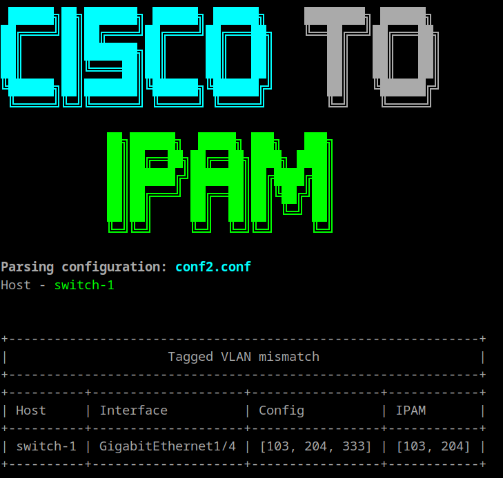
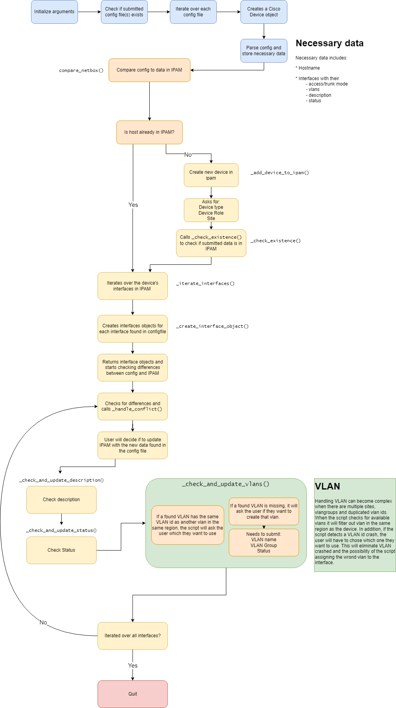

# Cisco to IPAM



## Usage
```
usage: cisco-to-ipam.py [-h] -c CONFIG [CONFIG ...] -u URL -t TOKEN [-i] [-a] [-v]

options:
  -h, --help            show this help message and exit
  -c CONFIG [CONFIG ...], --config CONFIG [CONFIG ...]
                        The path of config file(s)
  -u URL, --url URL     The NetBox URL
  -t TOKEN, --token TOKEN
                        The NetBox API token
  -i, --interactive     Interactively prompt for resolution to differences
  -a, --autoupdate      Auto update data to ipam
  -v, --verbose         Verbose - Prints summary of extracted data from config file
```

### Example
```
python cisco-to-ipam.py -c switch1.conf switch2.conf -u <ipam.site.com -t <token> -i 
```


## Installation

**Linux**
```bash
python3 -m venv venv
source venv/bin/activate
pip3 install ciscoconfparse OR python3 -m pip install ciscoconfparse
```

**Windows**
```powershell
python -m venv venv
.\venv\Scripts\Activate.ps1
pip3 install ciscoconfparse OR python -m pip install ciscoconfparse
```


# Flow


